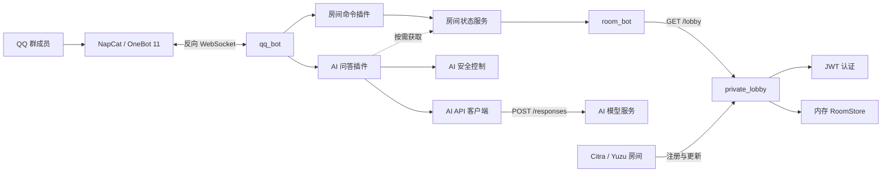

# QQ Group Bot

一个面向游戏联机群的 QQ 机器人项目，提供 Citra/Yuzu 私有大厅、房间状态查询和可选的 AI 问答能力。

项目使用 NoneBot2 接收 OneBot 11 群消息，通过内部 FastAPI 大厅维护房间状态。机器人可以响应 `/房间` 命令，也可以在群成员 `@机器人` 时调用兼容 OpenAI Responses API 的模型服务。

## 功能

- 通过 OneBot 11 反向 WebSocket 接入 QQ；
- 使用 `/房间` 查询预配置的 Citra/Yuzu 房间状态；
- 显示每个房间的端口、人数、容量和玩家昵称；
- 提供房间注册、玩家更新、注销和查询 API；
- 使用 RS256 JWT 验证房间程序身份；
- 可选接入兼容 OpenAI Responses API 的 AI 服务；
- AI 问答默认保留按群隔离的 15 分钟短期记忆；
- AI 回答可按需附带脱敏后的实时房间状态；
- 可选启用模型服务的 `web_search` 工具；
- 内置群白名单、输入输出过滤、滑动窗口限流和并发限制；
- 为机器人、房间领域逻辑和私有大厅提供自动化测试。

## 架构



消息处理链路如下：

```text
QQ 群消息
  -> NapCat OneBot 11
  -> NoneBot 插件
  -> 应用服务
  -> 私有大厅或 AI API
  -> 文本回复
```

## 目录结构

```text
qq-group-bot/
├── qq_bot/                         # QQ 机器人应用
│   ├── __main__.py                 # python -m qq_bot 入口
│   ├── app.py                      # NoneBot 初始化和插件加载
│   ├── config.py                   # 机器人环境变量解析与校验
│   ├── plugins/
│   │   ├── room.py                 # /房间 命令
│   │   └── ai.py                   # @机器人 AI 问答
│   ├── services/
│   │   ├── room_status.py          # 大厅查询与报告用例
│   │   └── ai_chat.py              # Responses API 客户端
│   ├── security/
│   │   └── ai_guard.py             # 限流、并发和敏感信息过滤
│   ├── napcat/
│   │   ├── onebot11.json           # OneBot 反向 WebSocket 模板
│   │   └── entrypoint.sh           # NapCat Token 注入脚本
│   ├── tests/
│   ├── Dockerfile
│   └── requirements*.txt
├── room_bot/                       # 房间状态领域逻辑
│   ├── room_report.py              # 房间映射、快照和文本渲染
│   └── tests/
├── private_lobby/                  # 私有大厅 HTTP 服务
│   ├── app/
│   │   ├── main.py                 # FastAPI 路由与应用组装
│   │   ├── auth.py                 # JWT 签发与验证
│   │   ├── config.py               # 大厅配置
│   │   ├── domain.py               # API 模型和领域模型
│   │   └── store.py                # 内存房间仓库与 TTL 清理
│   ├── tests/
│   ├── Dockerfile
│   ├── README.md
│   └── requirements*.txt
└── .dockerignore
```

## 运行要求

- Python 3.12 或更高版本；
- 可用的 OneBot 11 实现，当前仓库按 NapCat 反向 WebSocket 配置；
- Citra Canary 2798 或 Yuzu Mainline 1734 房间容器；
- 可选：兼容 OpenAI Responses API 的 HTTPS 模型服务；
- 可选：Docker 24 或更高版本。

`qq_bot` 镜像当前基于 Python 3.12，`private_lobby` 镜像当前基于 Python 3.13。

## 快速开始

仓库目前没有提供 `docker-compose.yml`，下面分别说明本地进程和 Docker 的启动方式。完整部署还需要将 NapCat、机器人、私有大厅和游戏房间加入同一网络。

### 1. 启动私有大厅

进入大厅目录并创建虚拟环境：

```bash
cd private_lobby
python3 -m venv .venv
.venv/bin/pip install -r requirements.txt
```

设置共享 Token 和密钥目录：

```bash
export LOBBY_SHARED_TOKEN='replace-with-a-long-random-token'
export LOBBY_KEY_DIRECTORY='/tmp/private-lobby-keys'
```

启动服务：

```bash
.venv/bin/uvicorn app.main:app \
  --host 127.0.0.1 \
  --port 8080 \
  --no-access-log
```

验证健康状态：

```bash
curl http://127.0.0.1:8080/health
```

预期响应：

```json
{"status":"ok"}
```

生产部署时，大厅只应加入内部网络，不应直接向公网暴露端口。

### 2. 启动 QQ 机器人

在另一个终端回到仓库根目录：

```bash
python3 -m venv .venv
.venv/bin/pip install -r qq_bot/requirements.txt
```

配置允许使用机器人的 QQ 群、大厅地址和 OneBot 访问令牌：

```bash
export QQ_BOT_ALLOWED_GROUPS='1032631393'
export PRIVATE_LOBBY_URL='http://127.0.0.1:8080/lobby'
export ONEBOT_V11_ACCESS_TOKEN='replace-with-a-long-random-token'
```

如果 NapCat 不在同一台机器上，还需要让 NoneBot 监听可访问的网络接口：

```bash
export HOST='0.0.0.0'
export PORT='8080'
```

启动机器人：

```bash
.venv/bin/python -m qq_bot
```

NoneBot 默认监听配置由其环境变量和驱动配置决定。NapCat 的反向 WebSocket 地址必须指向机器人提供的 OneBot 11 WebSocket 端点。

### 3. 配置 NapCat

仓库中的 `qq_bot/napcat/onebot11.json` 使用以下反向 WebSocket 地址：

```text
ws://qq-bot:8080/onebot/v11/ws
```

该地址适用于 Docker 网络中服务名为 `qq-bot` 的部署。非 Docker 环境应将主机名和端口改成机器人实际监听地址。

配置模板中的 `__ONEBOT_ACCESS_TOKEN__` 会由 `qq_bot/napcat/entrypoint.sh` 使用 `ONEBOT_ACCESS_TOKEN` 环境变量替换。机器人侧使用 `ONEBOT_V11_ACCESS_TOKEN` 配置适配器；两个变量的值必须相同，否则连接会被拒绝。

### 4. 使用机器人

在允许的 QQ 群中发送：

```text
/房间
```

机器人会返回预配置的 Yuzu 和 Citra 房间状态。

配置 AI 后，在群内 `@机器人` 并输入问题即可触发 AI 问答。只有提问包含房间、空位、人数、Yuzu、Citra、GU、XX、4G、3G 等关键词时，机器人才会额外查询大厅并把脱敏后的房间状态加入模型上下文。

## Docker

### 构建私有大厅

`private_lobby/Dockerfile` 的构建上下文是 `private_lobby` 目录：

```bash
docker build -t qq-group-private-lobby ./private_lobby
```

启动示例：

```bash
docker network create qq-group-bot

docker run -d \
  --name private-lobby \
  --network qq-group-bot \
  -e LOBBY_SHARED_TOKEN='replace-with-a-long-random-token' \
  -v private-lobby-keys:/data/keys \
  qq-group-private-lobby
```

容器内监听 `8080`，并包含 `/health` 健康检查。示例没有发布宿主机端口，以保持大厅只在内部网络可见。

### 构建机器人

`qq_bot/Dockerfile` 会同时复制 `qq_bot` 和 `room_bot`，因此必须从仓库根目录构建：

```bash
docker build -f qq_bot/Dockerfile -t qq-group-bot .
```

启动示例：

```bash
docker run -d \
  --name qq-bot \
  --network qq-group-bot \
  -e HOST='0.0.0.0' \
  -e PORT='8080' \
  -e ONEBOT_V11_ACCESS_TOKEN='replace-with-a-long-random-token' \
  -e QQ_BOT_ALLOWED_GROUPS='1032631393' \
  -e PRIVATE_LOBBY_URL='http://private-lobby:8080/lobby' \
  qq-group-bot
```

机器人还需要由 NapCat 通过 OneBot 11 反向 WebSocket 连接。仅启动上述两个容器不会自动登录 QQ。

## 配置

### QQ 机器人

| 环境变量 | 默认值 | 说明 |
| --- | --- | --- |
| `HOST` | `127.0.0.1` | NoneBot 监听地址；容器部署通常设为 `0.0.0.0` |
| `PORT` | `8080` | NoneBot HTTP/WebSocket 监听端口 |
| `ONEBOT_V11_ACCESS_TOKEN` | 空 | OneBot V11 适配器访问令牌，应与 NapCat 令牌一致 |
| `QQ_BOT_ALLOWED_GROUPS` | 空 | 允许使用机器人的群号，多个群号用逗号分隔；为空时允许所有群 |
| `PRIVATE_LOBBY_URL` | `http://private-lobby:8080/lobby` | 私有大厅房间列表地址 |
| `ROOM_REPORT_TIMEOUT_SECONDS` | `5` | 查询大厅超时时间，必须大于 0 |
| `ROOM_REPORT_TIMEZONE` | `Asia/Shanghai` | 房间报告时间所使用的 IANA 时区 |

### AI 功能

AI 默认关闭。只有同时配置 `AI_BASE_URL`、`AI_API_KEY` 和 `AI_MODEL` 后，AI 插件才会注册。

| 环境变量 | 默认值 | 说明 |
| --- | --- | --- |
| `AI_BASE_URL` | 空 | Responses API 基础地址，必须是 HTTPS，结尾不需要 `/` |
| `AI_API_KEY` | 空 | 模型服务 API Key |
| `AI_MODEL` | 空 | 模型名称 |
| `AI_WEB_SEARCH_ENABLED` | `false` | 是否在请求中启用 `web_search` 工具 |
| `AI_PERSONA_PROMPT` | 内置中文游戏助手提示词 | 附加角色提示词，不得包含 API Key |
| `AI_TIMEOUT_SECONDS` | `20` | AI 请求超时时间 |
| `AI_MAX_INPUT_CHARS` | `1000` | 单次输入最大字符数 |
| `AI_MAX_OUTPUT_CHARS` | `2000` | 发送到 QQ 前的最大输出字符数 |
| `AI_MAX_OUTPUT_TOKENS` | `512` | 传给模型服务的最大输出 Token 数 |
| `AI_RATE_LIMIT_REQUESTS` | `5` | 限流窗口内每个“群 + 用户”的最大请求数 |
| `AI_RATE_LIMIT_WINDOW_SECONDS` | `60` | 滑动窗口长度，单位为秒 |
| `AI_MAX_CONCURRENCY` | `2` | 当前机器人进程允许的 AI 并发数 |
| `AI_MEMORY_ENABLED` | `true` | 是否启用按群共享的短期记忆；关闭后恢复为单轮问答 |
| `AI_MEMORY_TTL_SECONDS` | `900` | 每条问答在本进程内保留的时长，单位为秒；新问答不会读取已过期记录 |
| `AI_MEMORY_MAX_TURNS` | `6` | 每个群最多保留的问答轮次，超出时从最早记录开始裁剪 |
| `AI_MEMORY_MAX_CHARS` | `8000` | 每个群用于模型上下文的历史最大字符数，超出时从最早记录开始裁剪 |
| `AI_MEMORY_MAX_GROUPS` | `256` | 本进程最多维护的群记忆数，超出时优先淘汰空闲的最久未使用群 |

短期记忆只保存于机器人进程内存；重启机器人会清空全部记录。同一群的 AI 请求会依次处理，因此后一条请求只会看到已完成的前序问答。历史对话作为不可信数据传入模型，不能改变系统提示词或工具权限。

AI 配置示例：

```bash
export AI_BASE_URL='https://api.example.com/v1'
export AI_API_KEY='replace-with-your-api-key'
export AI_MODEL='example-model'
export AI_WEB_SEARCH_ENABLED='false'
```

模型服务必须兼容以下调用方式：

```text
POST {AI_BASE_URL}/responses
Authorization: Bearer {AI_API_KEY}
Content-Type: application/json
```

客户端会发送 `model`、`instructions`、`input`、`max_output_tokens` 和 `store: false`。开启网页搜索时还会发送 `tools: [{"type": "web_search"}]`。

### 私有大厅

| 环境变量 | 默认值 | 说明 |
| --- | --- | --- |
| `LOBBY_SHARED_TOKEN` | 无 | 房间程序换取 JWT 所需的共享 Token |
| `LOBBY_SHARED_TOKEN_FILE` | 无 | 从文件读取共享 Token；仅在未设置 `LOBBY_SHARED_TOKEN` 时使用 |
| `LOBBY_KEY_DIRECTORY` | `/data/keys` | RSA 私钥和公钥的持久化目录 |
| `LOBBY_ROOM_TTL_SECONDS` | `60` | 房间最后更新后保留的秒数 |
| `LOBBY_JWT_TTL_SECONDS` | `3600` | 房间 JWT 有效期，单位为秒 |

`LOBBY_SHARED_TOKEN` 与 `LOBBY_SHARED_TOKEN_FILE` 至少设置一个。容器环境建议使用 Secret 文件并配置 `LOBBY_SHARED_TOKEN_FILE`。

### NapCat

| 环境变量 | 默认值 | 说明 |
| --- | --- | --- |
| `ONEBOT_ACCESS_TOKEN` | 无 | 渲染 `onebot11.json` 所需的 OneBot 访问令牌 |

`qq_bot/napcat/entrypoint.sh` 在变量缺失时会直接退出。

## 私有大厅 API

大厅关闭了 Swagger、ReDoc 和 OpenAPI 路由，只提供运行所需接口。

| 方法 | 路径 | 认证 | 说明 |
| --- | --- | --- | --- |
| `GET` | `/health` | 无 | 健康检查 |
| `POST` | `/jwt/internal` | `x-username`、`x-token` | 用共享 Token 换取 RS256 JWT |
| `GET` | `/jwt/external/key.pem` | 无 | 获取 JWT 校验公钥 |
| `GET` | `/lobby` | 无 | 获取当前有效房间列表 |
| `POST` | `/lobby` | Bearer JWT | 注册房间 |
| `POST` | `/lobby/{room_id}` | Bearer JWT | 更新房间玩家列表 |
| `DELETE` | `/lobby/{room_id}` | Bearer JWT | 注销房间 |

### 获取 JWT

```bash
TOKEN=$(curl -fsS \
  -X POST \
  -H 'x-username: room-host' \
  -H 'x-token: replace-with-a-long-random-token' \
  http://127.0.0.1:8080/jwt/internal)
```

### 注册房间

```bash
curl -fsS \
  -X POST \
  -H "Authorization: Bearer $TOKEN" \
  -H 'Content-Type: application/json' \
  -d '{
    "port": 9001,
    "name": "测试房间",
    "description": "内部大厅测试",
    "preferredGameName": "Monster Hunter",
    "preferredGameId": 72188436070367232,
    "maxPlayers": 4,
    "netVersion": 1,
    "hasPassword": false,
    "players": []
  }' \
  http://127.0.0.1:8080/lobby
```

响应中的 `id` 用于后续更新和注销。只有签发给同一 `username` 的 JWT 才能操作该房间。

### 查询房间

```bash
curl -fsS http://127.0.0.1:8080/lobby
```

响应结构：

```json
{
  "rooms": [
    {
      "port": 9001,
      "name": "测试房间",
      "description": "内部大厅测试",
      "preferredGameName": "Monster Hunter",
      "preferredGameId": 72188436070367232,
      "maxPlayers": 4,
      "netVersion": 1,
      "hasPassword": false,
      "players": [],
      "externalGuid": "...",
      "id": "...",
      "address": "...",
      "owner": "room-host"
    }
  ]
}
```

## 房间配置

机器人展示的房间不是从大厅动态发现后全部输出，而是将大厅数据投影到 `room_bot/room_report.py` 中的 `MANAGED_ROOMS`。

每个受管房间由以下字段识别：

- 平台：`Yuzu` 或 `Citra`；
- 显示标签；
- 完整房间名称；
- 端口；
- 默认最大人数。

大厅中的房间必须同时匹配配置里的完整名称和端口，才能被识别为对应的受管房间。修改群号、房间名称或端口时，需要同步调整 `MANAGED_ROOMS`。

## 状态与安全边界

### 大厅状态

`private_lobby` 使用进程内的 `RoomStore`：

- 房间状态不会写入数据库；
- 大厅重启后所有房间记录都会丢失；
- 房间超过 TTL 未更新会在下一次仓库操作时被清理；
- 多进程或多副本之间不会共享状态；
- 当前设计适合单实例、单 worker 的内部大厅。

房间程序应在更新接口返回 `404` 后重新注册。

### JWT 和密钥

- 共享 Token 仅用于 `/jwt/internal`；
- JWT 使用启动时加载或创建的 2048 位 RSA 密钥，以 RS256 签名；
- 私钥文件权限会设置为 `0600`；
- Docker 部署必须持久化 `/data/keys`，否则重建容器会更换密钥；
- 不要把共享 Token、API Key、JWT 或私钥提交到仓库。

### AI 防护

机器人在调用模型前后执行以下约束：

- 移除不可见控制字符；
- 拒绝空输入和超长输入；
- 检测常见 API Key、访问令牌和私钥格式；
- 防止配置的 API Key 出现在用户输入或模型输出中；
- 按“群号 + 用户号”执行进程内滑动窗口限流；
- 限制当前进程的 AI 并发请求数；
- 禁止 HTTP AI 地址、URL 凭据、查询参数和片段；
- 不跟随 AI API 重定向，也不读取系统代理环境变量；
- 网页搜索引用只保留公开 HTTP/HTTPS 地址，过滤本地和非公网 IP。

这些防护只覆盖机器人自身的请求边界，不能代替模型服务侧的鉴权、配额、审计和内容安全策略。

## 测试

### 运行机器人和房间逻辑测试

从仓库根目录执行：

```bash
python3 -m venv .venv
.venv/bin/pip install -r qq_bot/requirements.txt -r qq_bot/requirements-dev.txt
.venv/bin/python -m pytest qq_bot/tests room_bot/tests
```

### 运行私有大厅测试

```bash
cd private_lobby
python3 -m venv .venv
.venv/bin/pip install -r requirements-dev.txt
LOBBY_SHARED_TOKEN='test-token' \
LOBBY_KEY_DIRECTORY='/tmp/private-lobby-test-keys' \
.venv/bin/python -m pytest
```

测试覆盖的主要行为包括：

- 群白名单和配置校验；
- AI 请求载荷、响应解析和引用过滤；
- AI 输入输出保护、限流和并发控制；
- 房间状态投影与文本渲染；
- 大厅 JWT、房间注册、更新、所有权校验和 TTL 清理。

## 常见问题

### `/房间` 返回“暂时无法获取”

依次检查：

1. `PRIVATE_LOBBY_URL` 是否可以从机器人所在网络访问；
2. URL 是否包含 `/lobby` 路径；
3. 私有大厅是否通过 `/health` 健康检查；
4. 机器人和大厅是否处于同一个 Docker 网络；
5. `ROOM_REPORT_TIMEOUT_SECONDS` 是否合理。

### 大厅有房间，但机器人显示 Nobody Here

机器人按“完整房间名称 + 端口”匹配 `MANAGED_ROOMS`。确认游戏房间注册的 `name` 和 `port` 与 `room_bot/room_report.py` 完全一致。

### AI 插件没有响应

确认：

1. `AI_BASE_URL`、`AI_API_KEY`、`AI_MODEL` 已同时配置；
2. `AI_BASE_URL` 使用 HTTPS；
3. 模型服务支持 `/responses` 接口，而不是仅支持 `/chat/completions`；
4. 群号在 `QQ_BOT_ALLOWED_GROUPS` 中；
5. 消息确实 `@` 了机器人；
6. 没有触发频率或并发限制。

### NapCat 无法连接机器人

确认 NapCat 反向 WebSocket URL 与机器人监听地址一致，并保证 NapCat 的 `ONEBOT_ACCESS_TOKEN` 和机器人侧的 `ONEBOT_V11_ACCESS_TOKEN` 值相同。Docker 环境中的 `qq-bot` 是服务名，不是固定公网域名。

## 开发约定

- `plugins/` 只负责消息匹配、调用用例和回复用户；
- `services/` 负责外部服务访问和应用流程；
- `security/` 负责可复用的请求边界控制；
- `room_bot/` 负责大厅数据到领域快照、展示文本的纯转换；
- `private_lobby/app/domain.py` 保存 API 模型和房间领域模型；
- `private_lobby/app/store.py` 只负责房间状态生命周期。

新增功能时应保持上述依赖方向，避免让领域转换代码依赖 NoneBot、FastAPI 或具体网络客户端。

## 当前限制

- 仓库尚未提供 Docker Compose 或 Kubernetes 编排文件；
- 私有大厅只支持单实例内存状态，不支持水平扩展；
- 受管房间列表目前硬编码在源码中；
- NapCat 容器镜像和 QQ 登录流程不由本仓库提供；
- AI 客户端只支持兼容 OpenAI Responses API 的响应结构；
- 项目暂未声明开源许可证。